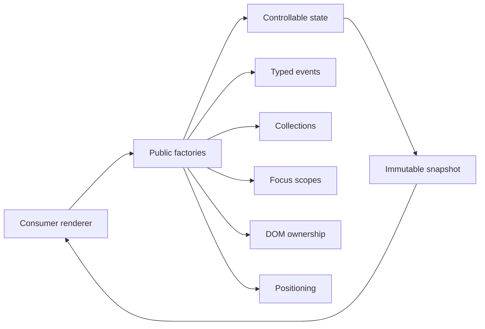

# Architecture overview

UI Headless Runtime separates behavior from rendering. Public factories create long-lived controllers; controllers expose immutable snapshots, commands, typed lifecycle events, DOM binding, and idempotent cleanup. The consumer owns markup, CSS, labels, content, and framework integration.

The package has zero runtime dependencies and no CSS. Shared layers prevent per-component implementations of controlled state, event delivery, item traversal, focus containment, outside interaction, scroll lock, or anchored geometry.

## Lifecycle

1. Create a controller without touching browser globals.
2. Subscribe and render its current snapshot.
3. Bind rendered DOM where the pattern needs focus or outside interaction.
4. Forward native keyboard, pointer, input, and composition events.
5. Release binding/subscription functions and call `destroy()` during unmount.

`destroy()` is idempotent. The final snapshot remains readable, new subscriptions are inert, and commands become no-ops.
